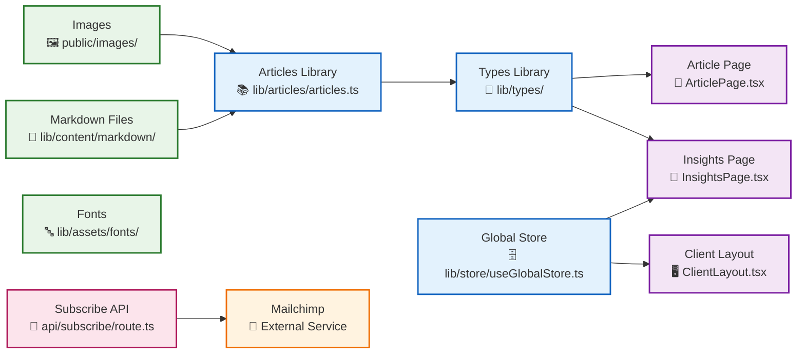

# Kriptaz Invest - Site Architecture & Component Structure

## 🏗️ Complete Site Architecture Diagram

```mermaid
graph TB
    %% Root Layout
    RootLayout[RootLayout<br/>📄 layout.tsx]
    
    %% Client Layout
    ClientLayout[ClientLayout<br/>🖥️ ClientLayout.tsx]
    
    %% Layout Components
    Header[Header<br/>🧭 Header.tsx]
    Footer[Footer<br/>🦶 Footer.tsx]
    Cookies[Cookies<br/>🍪 Cookies.tsx]
    ErrorBoundary[ErrorBoundary<br/>⚠️ ErrorBoundary.tsx]
    
    %% Header Sub-components
    Logo[Logo<br/>🏷️ Logo.tsx]
    Navigation[Navigation<br/>🧭 Navigation.tsx]
    HeaderButtons[HeaderButtons<br/>🔘 HeaderButtons.tsx]
    
    %% Pages
    HomePage[Home Page<br/>🏠 page.tsx]
    AboutPage[About Page<br/>ℹ️ about/page.tsx]
    InsightsPage[Insights Page<br/>📰 insights/page.tsx]
    ArticlePage[Article Page<br/>📄 insights/[slug]/page.tsx]
    MembersPage[Members Page<br/>👥 members/page.tsx]
    ContactPage[Contact Page<br/>📞 contact/page.tsx]
    JoinPage[Join Page<br/>🤝 join/page.tsx]
    PortfolioPage[Portfolio Page<br/>💼 portfolio/page.tsx]
    
    %% Home Page Components
    Hero[Hero<br/>🎬 Hero.tsx]
    TVL[TVL<br/>📊 TVL.tsx]
    Rates[Rates<br/>💰 Rates.tsx]
    Subscribe[Subscribe<br/>📧 Subscribe.tsx]
    ProjectSlider[ProjectSlider<br/>🎠 ProjectSlider.tsx]
    
    %% About Page Components
    AboutHero[AboutHero<br/>🎯 AboutHero.tsx]
    AboutPartners[AboutPartners<br/>🤝 AboutPartners.tsx]
    AboutCareers[AboutCareers<br/>💼 AboutCareers.tsx]
    
    %% Insights Page Components
    InsightsPageComponent[InsightsPage<br/>📰 InsightsPage.tsx]
    FeaturedArticle[FeaturedArticle<br/>⭐ FeaturedArticle.tsx]
    ArticleCard[ArticleCard<br/>📋 ArticleCard.tsx]
    
    %% Members Page Components
    MembersTeam[MembersTeam<br/>👥 MembersTeam.tsx]
    
    %% Common Components
    Loading[Loading<br/>⏳ Loading.tsx]
    
    %% API Routes
    SubscribeAPI[Subscribe API<br/>📧 api/subscribe/route.ts]
    
    %% Library Structure
    ArticlesLib[Articles Library<br/>📚 lib/articles/articles.ts]
    TypesLib[Types Library<br/>🔧 lib/types/]
    StoreLib[Store Library<br/>🗄️ lib/store/useGlobalStore.ts]
    ContentLib[Content Library<br/>📝 lib/content/markdown/]
    AssetsLib[Assets Library<br/>🎨 lib/assets/fonts/]
    
    %% Connections
    RootLayout --> ClientLayout
    ClientLayout --> Header
    ClientLayout --> Footer
    ClientLayout --> Cookies
    ClientLayout --> ErrorBoundary
    
    %% Header Structure
    Header --> Logo
    Header --> Navigation
    Header --> HeaderButtons
    
    %% Page Routing
    ClientLayout --> HomePage
    ClientLayout --> AboutPage
    ClientLayout --> InsightsPage
    ClientLayout --> ArticlePage
    ClientLayout --> MembersPage
    ClientLayout --> ContactPage
    ClientLayout --> JoinPage
    ClientLayout --> PortfolioPage
    
    %% Home Page Structure
    HomePage --> Hero
    HomePage --> TVL
    HomePage --> Rates
    HomePage --> Subscribe
    HomePage -.-> ProjectSlider
    
    %% About Page Structure
    AboutPage --> AboutHero
    AboutPage --> AboutPartners
    AboutPage --> AboutCareers
    
    %% Insights Page Structure
    InsightsPage --> InsightsPageComponent
    InsightsPageComponent --> FeaturedArticle
    InsightsPageComponent --> ArticleCard
    
    %% Article Page Structure
    ArticlePage --> ArticlesLib
    
    %% Members Page Structure
    MembersPage --> MembersTeam
    
    %% Library Dependencies
    InsightsPageComponent --> ArticlesLib
    FeaturedArticle --> ArticlesLib
    ArticleCard --> ArticlesLib
    ArticlePage --> ArticlesLib
    
    %% Type Dependencies
    Header --> TypesLib
    Footer --> TypesLib
    Hero --> TypesLib
    TVL --> TypesLib
    Rates --> TypesLib
    Subscribe --> TypesLib
    ProjectSlider --> TypesLib
    Cookies --> TypesLib
    
    %% Store Dependencies
    ClientLayout --> StoreLib
    Cookies --> StoreLib
    
    %% Content Dependencies
    ArticlesLib --> ContentLib
    
    %% Asset Dependencies
    Logo --> AssetsLib
    
    %% API Dependencies
    Subscribe --> SubscribeAPI
    
    %% Styling
    classDef pageClass fill:#e1f5fe,stroke:#01579b,stroke-width:2px
    classDef componentClass fill:#f3e5f5,stroke:#4a148c,stroke-width:2px
    classDef layoutClass fill:#e8f5e8,stroke:#1b5e20,stroke-width:2px
    classDef libClass fill:#fff3e0,stroke:#e65100,stroke-width:2px
    classDef apiClass fill:#fce4ec,stroke:#880e4f,stroke-width:2px
    
    class HomePage,AboutPage,InsightsPage,ArticlePage,MembersPage,ContactPage,JoinPage,PortfolioPage pageClass
    class Hero,TVL,Rates,Subscribe,ProjectSlider,AboutHero,AboutPartners,AboutCareers,FeaturedArticle,ArticleCard,MembersTeam,Loading componentClass
    class RootLayout,ClientLayout,Header,Footer,Cookies,ErrorBoundary,Logo,Navigation,HeaderButtons,InsightsPageComponent layoutClass
    class ArticlesLib,TypesLib,StoreLib,ContentLib,AssetsLib libClass
    class SubscribeAPI apiClass
```

## 📊 Component Hierarchy

```mermaid
graph TD
    %% Application Structure
    App[Kriptaz Invest Application]
    
    %% Layout Layer
    App --> Layout[Layout Layer]
    Layout --> RootLayout[RootLayout]
    Layout --> ClientLayout[ClientLayout]
    
    %% Navigation Layer
    Layout --> Navigation[Navigation Layer]
    Navigation --> Header[Header]
    Navigation --> Footer[Footer]
    
    %% Header Components
    Header --> Logo[Logo]
    Header --> Nav[Navigation]
    Header --> Buttons[HeaderButtons]
    
    %% Page Layer
    Layout --> Pages[Page Layer]
    
    %% Static Pages
    Pages --> Home[Home Page]
    Pages --> About[About Page]
    Pages --> Members[Members Page]
    Pages --> Contact[Contact Page]
    Pages --> Join[Join Page]
    Pages --> Portfolio[Portfolio Page]
    
    %% Dynamic Pages
    Pages --> Insights[Insights Page]
    Pages --> Article[Article Page]
    
    %% Component Layer
    Pages --> Components[Component Layer]
    
    %% Home Components
    Components --> Hero[Hero]
    Components --> TVL[TVL]
    Components --> Rates[Rates]
    Components --> Subscribe[Subscribe]
    
    %% About Components
    Components --> AboutHero[AboutHero]
    Components --> AboutPartners[AboutPartners]
    Components --> AboutCareers[AboutCareers]
    
    %% Insights Components
    Components --> InsightsPage[InsightsPage]
    Components --> FeaturedArticle[FeaturedArticle]
    Components --> ArticleCard[ArticleCard]
    
    %% Members Components
    Components --> MembersTeam[MembersTeam]
    
    %% Common Components
    Components --> Loading[Loading]
    Components --> Cookies[Cookies]
    Components --> ErrorBoundary[ErrorBoundary]
    
    %% Library Layer
    App --> Libraries[Library Layer]
    Libraries --> Articles[Articles Library]
    Libraries --> Types[Types Library]
    Libraries --> Store[Store Library]
    Libraries --> Content[Content Library]
    Libraries --> Assets[Assets Library]
    
    %% API Layer
    App --> APIs[API Layer]
    APIs --> SubscribeAPI[Subscribe API]
    
    %% Styling
    classDef appClass fill:#ffebee,stroke:#c62828,stroke-width:3px
    classDef layerClass fill:#e3f2fd,stroke:#1565c0,stroke-width:2px
    classDef pageClass fill:#e8f5e8,stroke:#2e7d32,stroke-width:2px
    classDef componentClass fill:#f3e5f5,stroke:#7b1fa2,stroke-width:2px
    classDef libClass fill:#fff3e0,stroke:#ef6c00,stroke-width:2px
    classDef apiClass fill:#fce4ec,stroke:#ad1457,stroke-width:2px
    
    class App appClass
    class Layout,Navigation,Pages,Components,Libraries,APIs layerClass
    class Home,About,Members,Contact,Join,Portfolio,Insights,Article pageClass
    class Hero,TVL,Rates,Subscribe,AboutHero,AboutPartners,AboutCareers,InsightsPage,FeaturedArticle,ArticleCard,MembersTeam,Loading,Cookies,ErrorBoundary componentClass
    class Articles,Types,Store,Content,Assets libClass
    class SubscribeAPI apiClass
```



## 🔄 Data Flow Architecture



## 📱 Responsive Design Structure

```mermaid
graph TB
    %% Device Types
    Desktop[Desktop<br/>🖥️ > 1200px]
    Tablet[Tablet<br/>📱 768px - 1200px]
    Mobile[Mobile<br/>📱 < 768px]
    
    %% Layout Components
    Header[Header<br/>🧭 Responsive Header]
    Footer[Footer<br/>🦶 Responsive Footer]
    
    %% Header Responsive Behavior
    Header --> DesktopHeader[Desktop Header<br/>• Full Navigation<br/>• Logo + Buttons<br/>• Horizontal Layout]
    Header --> TabletHeader[Tablet Header<br/>• Condensed Navigation<br/>• Responsive Logo<br/>• Touch-friendly]
    Header --> MobileHeader[Mobile Header<br/>• Hamburger Menu<br/>• Stacked Layout<br/>• Mobile Logo]
    
    %% Page Components
    Hero[Hero Component<br/>🎬 Responsive Hero]
    TVL[TVL Component<br/>📊 Responsive TVL]
    Rates[Rates Component<br/>💰 Responsive Rates]
    Subscribe[Subscribe Component<br/>📧 Responsive Subscribe]
    
    %% Hero Responsive Behavior
    Hero --> DesktopHero[Desktop Hero<br/>• Full Video Background<br/>• Large Typography<br/>• Side-by-side Layout]
    Hero --> TabletHero[Tablet Hero<br/>• Optimized Video<br/>• Medium Typography<br/>• Stacked Layout]
    Hero --> MobileHero[Mobile Hero<br/>• Mobile Video<br/>• Compact Typography<br/>• Vertical Layout]
    
    %% Insights Page Responsive
    InsightsPage[Insights Page<br/>📰 Responsive Insights]
    InsightsPage --> DesktopInsights[Desktop Insights<br/>• 4-column Grid<br/>• Large Featured Article<br/>• Full-width Layout]
    InsightsPage --> TabletInsights[Tablet Insights<br/>• 3-column Grid<br/>• Medium Featured Article<br/>• Responsive Layout]
    InsightsPage --> MobileInsights[Mobile Insights<br/>• 1-column Grid<br/>• Stacked Featured Article<br/>• Mobile Layout]
    
    %% Styling
    classDef deviceClass fill:#e3f2fd,stroke:#1565c0,stroke-width:2px
    classDef componentClass fill:#f3e5f5,stroke:#7b1fa2,stroke-width:2px
    classDef responsiveClass fill:#e8f5e8,stroke:#2e7d32,stroke-width:2px
    
    class Desktop,Tablet,Mobile deviceClass
    class Header,Hero,TVL,Rates,Subscribe,InsightsPage componentClass
    class DesktopHeader,TabletHeader,MobileHeader,DesktopHero,TabletHero,MobileHero,DesktopInsights,TabletInsights,MobileInsights responsiveClass
```



## 🎨 CSS Architecture

```mermaid
graph TB
    %% CSS Structure
    GlobalCSS[Global CSS<br/>🌐 globals.css]
    
    %% CSS Modules
    CSSModules[CSS Modules<br/>🎨 Component Styles]
    
    %% Component Styles
    CSSModules --> HeaderCSS[Header.module.css<br/>🧭 Header Styles]
    CSSModules --> FooterCSS[Footer.module.css<br/>🦶 Footer Styles]
    CSSModules --> HeroCSS[Hero.module.css<br/>🎬 Hero Styles]
    CSSModules --> TVLCSS[TVL.module.css<br/>📊 TVL Styles]
    CSSModules --> RatesCSS[Rates.module.css<br/>💰 Rates Styles]
    CSSModules --> SubscribeCSS[Subscribe.module.css<br/>📧 Subscribe Styles]
    CSSModules --> InsightsCSS[InsightsPage.module.css<br/>📰 Insights Styles]
    CSSModules --> ArticleCSS[ArticleCard.module.css<br/>📋 Article Styles]
    CSSModules --> FeaturedCSS[FeaturedArticle.module.css<br/>⭐ Featured Styles]
    
    %% Global Styles
    GlobalCSS --> Variables[CSS Variables<br/>🎨 Design Tokens]
    GlobalCSS --> Typography[Typography<br/>📝 Font System]
    GlobalCSS --> Colors[Colors<br/>🎨 Color Palette]
    GlobalCSS --> Spacing[Spacing<br/>📏 Layout System]
    
    %% Design System
    Variables --> ColorTokens[Color Tokens<br/>• --color-white<br/>• --color-gray<br/>• --color-light-gray<br/>• --color-gray-dark]
    Variables --> FontTokens[Font Tokens<br/>• --font-gellix<br/>• --font-playfair<br/>• --font-primary]
    
    %% Responsive Design
    CSSModules --> Responsive[Responsive Design<br/>📱 Media Queries]
    Responsive --> Mobile[Mobile Styles<br/>📱 < 768px]
    Responsive --> Tablet[Tablet Styles<br/>📱 768px - 1200px]
    Responsive --> Desktop[Desktop Styles<br/>🖥️ > 1200px]
    
    %% Styling
    classDef globalClass fill:#e3f2fd,stroke:#1565c0,stroke-width:2px
    classDef moduleClass fill:#f3e5f5,stroke:#7b1fa2,stroke-width:2px
    classDef tokenClass fill:#e8f5e8,stroke:#2e7d32,stroke-width:2px
    classDef responsiveClass fill:#fff3e0,stroke:#ef6c00,stroke-width:2px
    
    class GlobalCSS globalClass
    class CSSModules,HeaderCSS,FooterCSS,HeroCSS,TVLCSS,RatesCSS,SubscribeCSS,InsightsCSS,ArticleCSS,FeaturedCSS moduleClass
    class Variables,ColorTokens,FontTokens,Typography,Colors,Spacing tokenClass
    class Responsive,Mobile,Tablet,Desktop responsiveClass
```



## 🔧 Technical Stack

```mermaid
graph TB
    %% Frontend Framework
    NextJS[Next.js 15<br/>⚡ React Framework]
    
    %% Language
    TypeScript[TypeScript<br/>🔷 Type Safety]
    
    %% Styling
    CSSModules[CSS Modules<br/>🎨 Scoped Styles]
    TailwindCSS[Tailwind CSS<br/>🎨 Utility Classes]
    
    %% State Management
    Zustand[Zustand<br/>🗄️ State Management]
    
    %% Content Management
    GrayMatter[Gray Matter<br/>📝 Frontmatter Parser]
    ReactMarkdown[React Markdown<br/>📄 Markdown Renderer]
    
    %% Icons
    ReactIcons[React Icons<br/>🎯 Icon Library]
    
    %% External Services
    Mailchimp[Mailchimp<br/>📧 Email Service]
    
    %% Development Tools
    ESLint[ESLint<br/>🔍 Code Linting]
    PostCSS[PostCSS<br/>🎨 CSS Processing]
    
    %% Build Tools
    Webpack[Webpack<br/>📦 Module Bundler]
    SWC[SWC<br/>⚡ Fast Compiler]
    
    %% Styling
    classDef frameworkClass fill:#e3f2fd,stroke:#1565c0,stroke-width:2px
    classDef languageClass fill:#e8f5e8,stroke:#2e7d32,stroke-width:2px
    classDef stylingClass fill:#f3e5f5,stroke:#7b1fa2,stroke-width:2px
    classDef stateClass fill:#fff3e0,stroke:#ef6c00,stroke-width:2px
    classDef contentClass fill:#fce4ec,stroke:#ad1457,stroke-width:2px
    classDef toolClass fill:#f1f8e9,stroke:#33691e,stroke-width:2px
    
    class NextJS frameworkClass
    class TypeScript languageClass
    class CSSModules,TailwindCSS stylingClass
    class Zustand stateClass
    class GrayMatter,ReactMarkdown contentClass
    class ReactIcons,Mailchimp,ESLint,PostCSS,Webpack,SWC toolClass
```



## 📊 Performance & SEO

```mermaid
graph TB
    %% Performance Features
    Performance[Performance<br/>⚡ Optimization]
    
    %% SEO Features
    SEO[SEO<br/>🔍 Search Optimization]
    
    %% Performance Optimizations
    Performance --> StaticGeneration[Static Generation<br/>📄 SSG]
    Performance --> ImageOptimization[Image Optimization<br/>🖼️ Next.js Image]
    Performance --> FontOptimization[Font Optimization<br/>🔤 Preloading]
    Performance --> CodeSplitting[Code Splitting<br/>📦 Dynamic Imports]
    Performance --> Compression[Compression<br/>🗜️ Gzip/Brotli]
    
    %% SEO Optimizations
    SEO --> Metadata[Metadata<br/>📋 Open Graph]
    SEO --> Sitemap[Sitemap<br/>🗺️ XML Sitemap]
    SEO --> Robots[Robots<br/>🤖 robots.txt]
    SEO --> StructuredData[Structured Data<br/>📊 JSON-LD]
    SEO --> CanonicalURLs[Canonical URLs<br/>🔗 Canonical Links]
    
    %% Static Generation Details
    StaticGeneration --> InsightsSSG[Insights SSG<br/>📰 Static Articles]
    StaticGeneration --> ArticleSSG[Article SSG<br/>📄 Static Pages]
    StaticGeneration --> HomeSSG[Home SSG<br/>🏠 Static Home]
    
    %% Image Optimization Details
    ImageOptimization --> WebP[WebP Format<br/>🖼️ Modern Images]
    ImageOptimization --> ResponsiveImages[Responsive Images<br/>📱 Multiple Sizes]
    ImageOptimization --> LazyLoading[Lazy Loading<br/>⏳ On-demand Loading]
    
    %% Styling
    classDef performanceClass fill:#e3f2fd,stroke:#1565c0,stroke-width:2px
    classDef seoClass fill:#e8f5e8,stroke:#2e7d32,stroke-width:2px
    classDef optimizationClass fill:#f3e5f5,stroke:#7b1fa2,stroke-width:2px
    classDef detailClass fill:#fff3e0,stroke:#ef6c00,stroke-width:2px
    
    class Performance,SEO performanceClass
    class StaticGeneration,ImageOptimization,FontOptimization,CodeSplitting,Compression optimizationClass
    class Metadata,Sitemap,Robots,StructuredData,CanonicalURLs seoClass
    class InsightsSSG,ArticleSSG,HomeSSG,WebP,ResponsiveImages,LazyLoading detailClass
```



## 🚀 Deployment & Infrastructure

```mermaid
graph TB
    %% Development Environment
    Development[Development<br/>💻 Local Development]
    
    %% Production Environment
    Production[Production<br/>🌐 Live Site]
    
    %% Development Tools
    Development --> DevServer[Dev Server<br/>⚡ npm run dev]
    Development --> HotReload[Hot Reload<br/>🔄 Live Updates]
    Development --> TypeChecking[Type Checking<br/>🔷 TypeScript]
    Development --> Linting[Linting<br/>🔍 ESLint]
    
    %% Build Process
    Production --> Build[Build Process<br/>📦 npm run build]
    Build --> Compilation[Compilation<br/>⚡ SWC Compiler]
    Build --> Optimization[Optimization<br/>🎯 Bundle Optimization]
    Build --> StaticGeneration[Static Generation<br/>📄 SSG]
    
    %% Deployment
    Production --> Deployment[Deployment<br/>🚀 Vercel/Netlify]
    Deployment --> CDN[CDN<br/>🌐 Global Distribution]
    Deployment --> SSL[SSL<br/>🔒 HTTPS]
    Deployment --> Monitoring[Monitoring<br/>📊 Analytics]
    
    %% Environment Variables
    Production --> EnvVars[Environment Variables<br/>🔧 Configuration]
    EnvVars --> SiteURL[Site URL<br/>🌐 NEXT_PUBLIC_SITE_URL]
    EnvVars --> GoogleVerification[Google Verification<br/>🔍 NEXT_PUBLIC_GOOGLE_VERIFICATION]
    EnvVars --> MailchimpAPI[Mailchimp API<br/>📧 MAILCHIMP_API_KEY]
    
    %% Styling
    classDef envClass fill:#e3f2fd,stroke:#1565c0,stroke-width:2px
    classDef toolClass fill:#f3e5f5,stroke:#7b1fa2,stroke-width:2px
    classDef processClass fill:#e8f5e8,stroke:#2e7d32,stroke-width:2px
    classDef deployClass fill:#fff3e0,stroke:#ef6c00,stroke-width:2px
    classDef configClass fill:#fce4ec,stroke:#ad1457,stroke-width:2px
    
    class Development,Production envClass
    class DevServer,HotReload,TypeChecking,Linting toolClass
    class Build,Compilation,Optimization,StaticGeneration processClass
    class Deployment,CDN,SSL,Monitoring deployClass
    class EnvVars,SiteURL,GoogleVerification,MailchimpAPI configClass
```



---

## 📋 Summary

**Kriptaz Invest** is a modern, professional cryptocurrency investment platform built with:

- **Next.js 15** with App Router
- **TypeScript** for type safety
- **CSS Modules** for scoped styling
- **Zustand** for state management
- **Dynamic content** with Markdown
- **Responsive design** for all devices
- **SEO optimization** with metadata
- **Performance optimization** with SSG
- **Professional architecture** with clean separation of concerns

The site features a comprehensive insights system with dynamic article management, professional UI components, and a scalable architecture designed for growth and maintainability.
